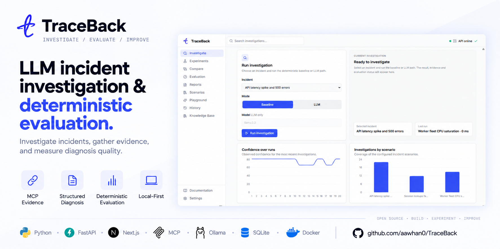
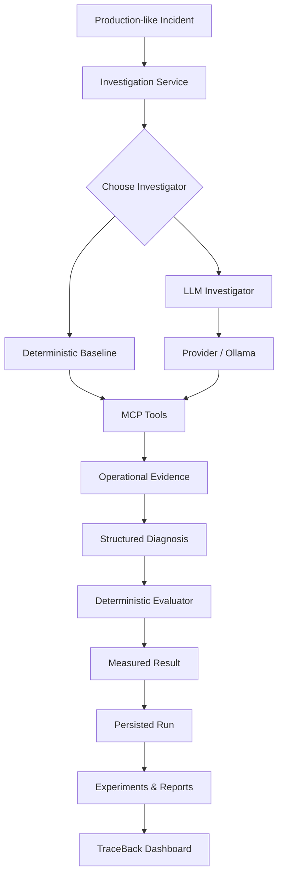
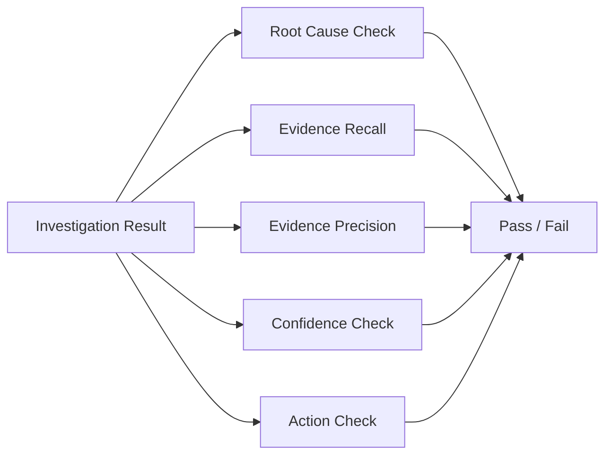
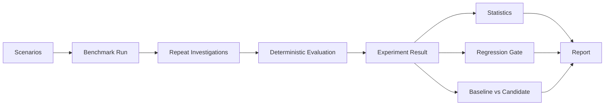
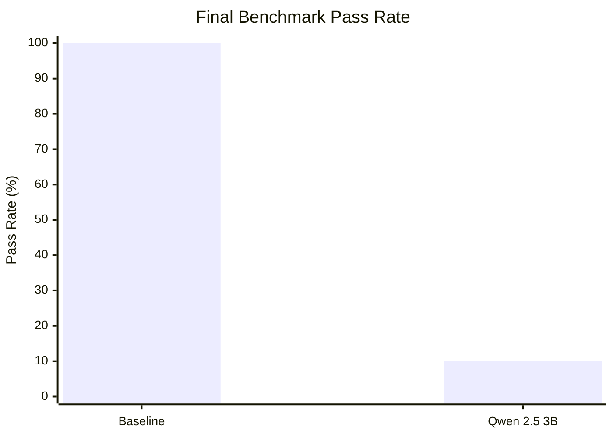
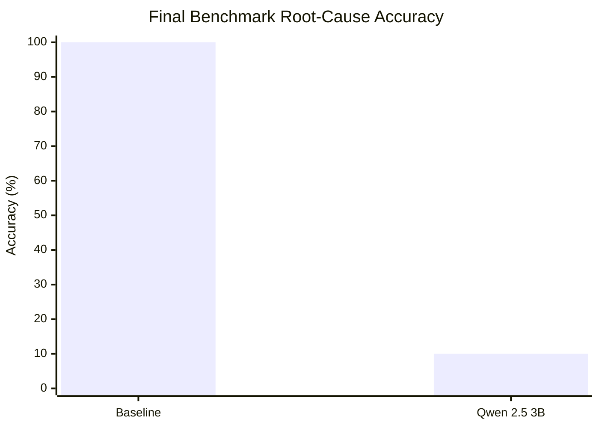

# TraceBack

> **Local-first LLM incident diagnosis and evaluation system for investigating production-like failures with MCP tools, structured evidence, and deterministic evaluation.**



TraceBack is an engineering-focused portfolio project exploring how LLMs can investigate software incidents without treating generated answers as automatically correct.

Given a production-like incident, TraceBack gathers operational evidence through tools, produces a structured diagnosis, identifies the likely root cause, cites the evidence used, recommends an action, and evaluates the result against deterministic ground truth.

The goal is not to build another chatbot or a Datadog/PagerDuty competitor. The goal is to build a small, testable system that makes **LLM incident diagnosis measurable**.

## Why TraceBack?

LLM incident investigation is easy to demonstrate and hard to evaluate. A model can produce a convincing explanation while selecting irrelevant evidence or identifying the wrong cause.

TraceBack separates:

- **Investigation** — what evidence the agent can gather.
- **Diagnosis** — what the model believes happened.
- **Grounding** — which evidence supports that diagnosis.
- **Evaluation** — whether the diagnosis matches deterministic expectations.

This makes model behavior measurable rather than purely subjective.

## Highlights

- **Tool-based incident investigation** through MCP
- **Structured diagnosis outputs** validated with Pydantic
- **Evidence grounding** through explicit evidence IDs
- **Deterministic evaluation** against scenario ground truth
- **Root-cause matching** using scenario-defined causal keywords
- **Evidence recall and precision** metrics
- **Repeated evaluation runs** for measuring model reliability
- **Aggregate reports** for comparing model/configuration behavior
- **Repeatable experiments** across scenarios and repetitions
- **Regression gates** for protecting measured investigation quality
- **Custom scenario authoring** with persisted ground truth and evidence
- **Custom MCP evidence sources** through a constrained remote-source contract
- **Model Playground** for baseline vs. Ollama investigation runs
- **Incident Knowledge Base** for deterministic search across known failure patterns and latest run state
- **Local-first inference** using Ollama
- **Provider-agnostic LLM boundary** so inference can be replaced without redesigning the system
- **FastAPI backend** and **Next.js dashboard**
- **SQLite persistence** for investigations, experiments, and scenarios
- **GitHub Actions CI**, CodeQL, dependency review, container scanning, SBOMs, and release automation

## Architecture



The key engineering boundary is simple: **the investigator generates a diagnosis; deterministic code evaluates it.**

See [docs/architecture.md](docs/architecture.md) for the detailed architecture notes.

## Current Scenarios

TraceBack ships with practical production-style failures including:

- **Database pool exhaustion**
- **Redis connectivity failure**
- **Runaway worker CPU saturation**

The dashboard can also create **custom scenarios** with an incident description, expected root cause, causal keywords, and evidence set. Custom scenarios immediately become available to investigation and benchmarking through the same scenario catalog.

## Technology Stack

| Layer | Technologies |
| --- | --- |
| Language | Python 3.12+ |
| API | FastAPI |
| Frontend | Next.js 15, React 19, TypeScript |
| UI | Tailwind CSS, Recharts, shadcn-style primitives |
| Agent/tool protocol | MCP |
| LLM inference | Ollama |
| Validation | Pydantic |
| Persistence | SQLite |
| Testing | Pytest |
| CI/CD | GitHub Actions |
| Containers | Docker / Docker Compose |
| Package / CLI | PyPI (`trbk`) |

## Evaluation and Benchmarking

For each investigation, TraceBack evaluates root-cause match, evidence recall, evidence precision, confidence validity, action presence, and overall pass/fail.



Benchmarking repeats the same evaluation across scenarios and repetitions, persists provenance, and supports regression gates and experiment comparisons.



### Final local benchmark snapshot

The final 10-repetition benchmark used the three built-in scenarios, giving **30 investigation runs per configuration**.

| Metric | Deterministic baseline | Qwen 2.5 3B |
| --- | ---: | ---: |
| Runs | 30 | 30 |
| Pass rate | **100.00%** | 10.00% |
| Root-cause accuracy | **100.00%** | 10.00% |
| Average confidence | 75.0% | **90.0%** |
| Average duration | **0.09 ms** | 2289.78 ms |
| Database pool exhaustion | 100.00% | 10.00% |
| Redis connectivity failure | 100.00% | 0.00% |
| Runaway worker CPU | 100.00% | 20.00% |





The baseline regression gate passed. The Qwen experiment failed the configured 100% pass-rate/root-cause threshold, which is intentional: TraceBack is designed to surface model reliability gaps rather than hide them.

> These figures are a local benchmark snapshot, not a claim of general model capability. Hardware, model version, Ollama configuration, prompts, scenario definitions, and repetitions can change the observed results.

## Install from PyPI

TraceBack is distributed as the `trbk` Python package and exposes the `trbk` command-line interface.

```powershell
python -m pip install trbk
trbk --help
trbk scenarios
```

The product remains branded **TraceBack**; `trbk` is the Python distribution and CLI name.

## Run Locally

TraceBack uses Python 3.12+ for the backend and Node.js 22 for the Next.js frontend.

### Backend

```powershell
py -3.12 -m venv .venv
.\.venv\Scripts\Activate.ps1
python -m pip install --upgrade pip
pip install -e ".[dev]"
python -m pytest
```

### Full stack with Docker Compose

```powershell
docker compose up --build -d
```

Open:

- Dashboard: `http://127.0.0.1:3000`
- API docs: `http://127.0.0.1:8000/docs`
- Health: `http://127.0.0.1:8000/health`

Stop the stack with:

```powershell
docker compose down
```

### Frontend outside Docker

```powershell
cd frontend
npm install
npm run typecheck
npm run build
npm run dev
```

Then open `http://127.0.0.1:3000`.

## Investigation

Run a deterministic baseline investigation without an LLM:

```powershell
trbk investigate database-pool-exhaustion
```

LLM-backed investigation uses Ollama:

```powershell
trbk investigate database-pool-exhaustion --mode llm --model llama3.2
```

The dashboard's investigation, experiments, playground, history, reports, scenarios, evaluation, comparison, and knowledge views call the real backend contracts.

## Model Playground

Open **Playground** in the dashboard to select a built-in or custom scenario, choose an Ollama model, and compare a deterministic baseline run with an LLM-backed run.

The result panel exposes the same diagnosis, evidence, evaluation outcome, latency, and run ID used elsewhere in TraceBack.

## Incident Knowledge Base

Open **Knowledge Base** to search reusable incident patterns. Results come from the same scenario catalog used by investigations, including custom scenarios, and expose expected root cause, evidence requirements, and the latest persisted evaluation state.

Search is deterministic by design; it is not an LLM-generated retrieval system.

```text
GET /knowledge?q=<query>&limit=<1-50>
```

## Custom Scenarios

Use the **Scenarios** view to author a reusable incident case. Each custom scenario stores a stable scenario ID and incident title, a production-style incident description, the expected root cause, causal keywords, one or more evidence items, and optional required evidence IDs for recall evaluation.

Custom scenarios are persisted in the same SQLite database as the rest of TraceBack and can participate in investigations, experiments, matrices, and the Knowledge Base.

## Custom MCP Evidence Sources

TraceBack can connect to configured remote MCP evidence sources through `TRACEBACK_MCP_EVIDENCE_SOURCES`.

The integration uses a strict structured evidence contract and preserves external-source attribution rather than silently mixing external data into built-in evidence.

See [docs/mcp-evidence-sources.md](docs/mcp-evidence-sources.md) for configuration and the expected MCP tool contract.

## CLI

After installing the package, the main commands are:

```text
trbk scenarios
trbk investigate <scenario-id>
trbk runs --scenario-id <scenario-id>
trbk show <run-id>
trbk stats --scenario-id <scenario-id>
trbk benchmark --repetitions 3 --name baseline-smoke
trbk experiments --limit 20
trbk experiment <experiment-id>
trbk compare <baseline-id> <candidate-id>
trbk matrix --name model-matrix --config baseline=baseline --config llama=llm:llama3.2
```

## API

Core endpoints include:

- `GET /health`
- `GET /scenarios`
- `POST /scenarios`
- `GET /scenarios/{scenario_id}`
- `POST /investigations`
- `GET /runs`
- `GET /runs/{run_id}`
- `GET /runs/stats`
- `POST /experiments`
- `GET /experiments`
- `GET /experiments/{experiment_id}`
- `GET /experiments/{baseline_id}/compare/{candidate_id}`
- `POST /experiments/matrix`
- `GET /knowledge?q=<query>&limit=<1-50>`
- `POST /jobs`
- `GET /jobs`
- `GET /jobs/{job_id}`
- `GET /ops/ready`
- `GET /ops/database`

FastAPI's generated documentation is available at `/docs`.

## MCP Development

Launch the evidence server locally with:

```powershell
python -m app.mcp.server
```

For MCP Inspector development:

```powershell
mcp dev app/mcp/server.py
```

## Persistence and Operations

Completed investigations, experiments, and custom scenarios are persisted locally in SQLite. TraceBack also exposes lightweight operational telemetry, readiness checks, request correlation, and durable job state.

The current deployment boundary is intentionally single-node and local-first. SQLite state can be mounted into `/data` when using the production container.

## Docker

Build the backend production image:

```powershell
docker build -t traceback:local .
```

Or run the complete stack:

```powershell
docker compose up --build -d
```

See [docs/deployment.md](docs/deployment.md) for deployment and configuration details.

## CI, Security, and Release Engineering

TraceBack includes GitHub Actions workflows for:

- Python/static verification and tests
- deterministic benchmark gating
- dependency review
- CodeQL analysis
- container vulnerability scanning with Trivy
- SPDX SBOM generation
- container releases
- build provenance / artifact attestation
- dependency maintenance via Dependabot

The repository also uses a non-root production container and keeps database state separate from the image.

See [SECURITY.md](SECURITY.md) for the security policy.

## Project Structure

```text
TraceBack/
├── .github/workflows/     # CI, security, dependency and release workflows
├── app/
│   ├── agent/             # investigators, LLM/provider boundary, runtime
│   ├── api/               # FastAPI routes and contracts
│   ├── evaluation/        # metrics, regression, comparison, benchmarking
│   ├── mcp/               # MCP evidence server and external-source integration
│   ├── models/             # domain contracts
│   ├── observability/     # telemetry and metrics
│   ├── providers/         # LLM providers
│   ├── repository/        # SQLite persistence
│   ├── scenarios/         # built-in and persisted incident scenarios
│   ├── services/           # application orchestration
│   └── tools/              # constrained investigation tools
├── frontend/              # Next.js investigation dashboard
├── docs/                  # architecture and operational contracts
├── tests/                 # automated behavior tests
├── Dockerfile             # backend image
├── compose.yaml           # backend + frontend stack
├── pyproject.toml
└── README.md
```

## Engineering Principles

- **Measure before claiming.** Resume metrics should come from actual evaluation runs.
- **Keep the evaluator deterministic.** Do not use an LLM to judge whether an LLM was correct.
- **Ground diagnoses in evidence.** A root cause without supporting evidence is not enough.
- **Keep tools real.** MCP integrations should represent actual investigation capabilities.
- **Prefer small abstractions.** Introduce infrastructure only when it solves a real problem.
- **Keep inference replaceable.** Ollama is an implementation choice, not the application's core abstraction.
- **Test behavior, not test count.** Tests should protect meaningful behavior and edge cases.
- **Do not build fake UI.** Every interactive capability should connect to real backend functionality.
- **Stay portfolio-sized.** TraceBack should demonstrate engineering depth without becoming an observability platform.

## Project Positioning

TraceBack complements rather than duplicates the rest of the portfolio:

- **Dasaiko** — RAG and retrieval engineering
- **ModelDock** — ML infrastructure and model serving
- **TraceBack** — LLM agents, MCP, evaluation, and reliability

## Status

The backend, evaluation system, persistence, runtime/job layer, Docker setup, CI/security hardening, custom scenario authoring, Model Playground, custom MCP evidence sources, Incident Knowledge Base, functional Next.js web UI, and PyPI/CLI distribution are implemented. The project is now in final integration validation and portfolio-polish mode.

## Author

### Aawhan Vyas

AI engineering, backend systems, full-stack development, and practical ML infrastructure.

- GitHub: [aawhan0](https://github.com/aawhan0)

## Security

See [SECURITY.md](SECURITY.md) for the security policy and responsible disclosure process.
